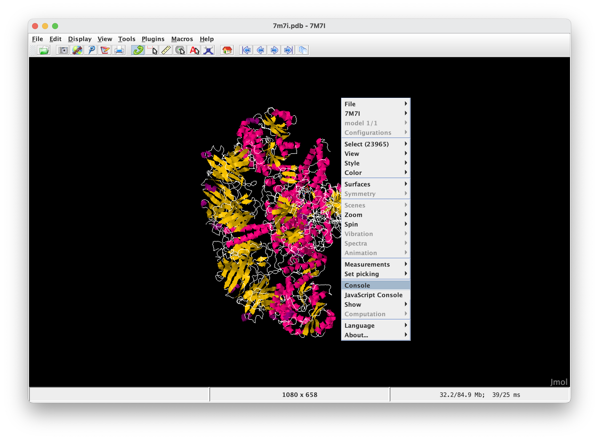
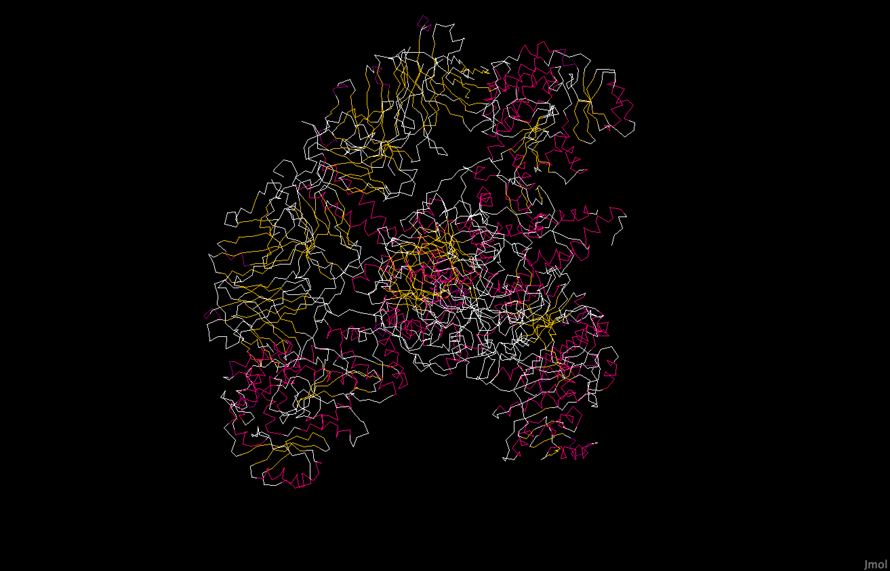
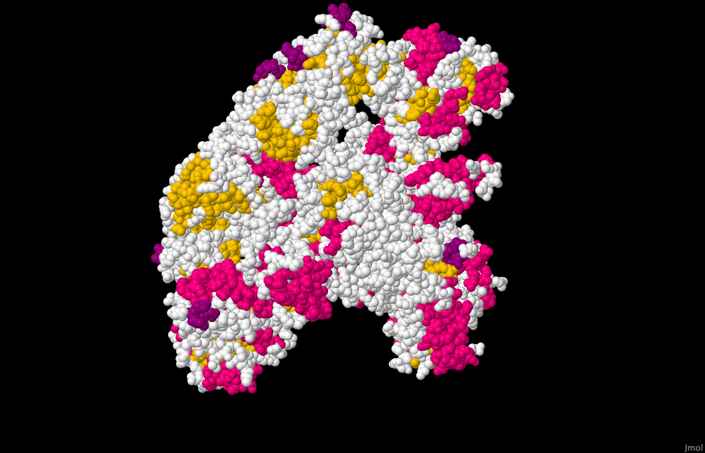
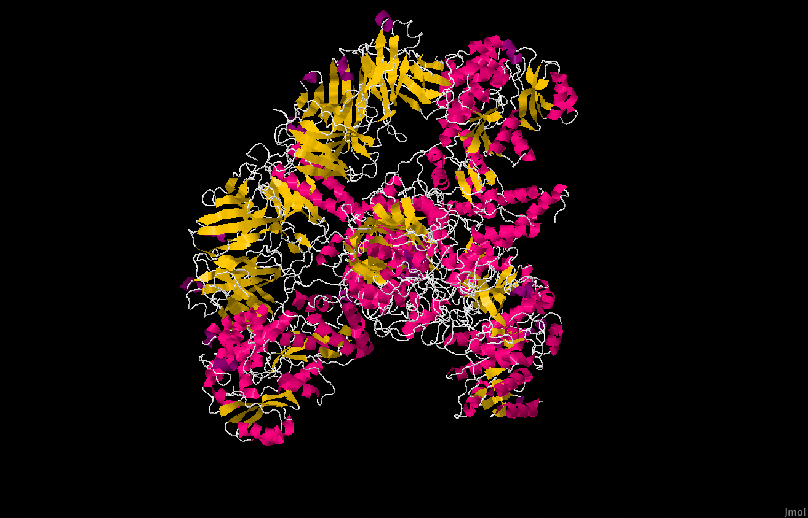
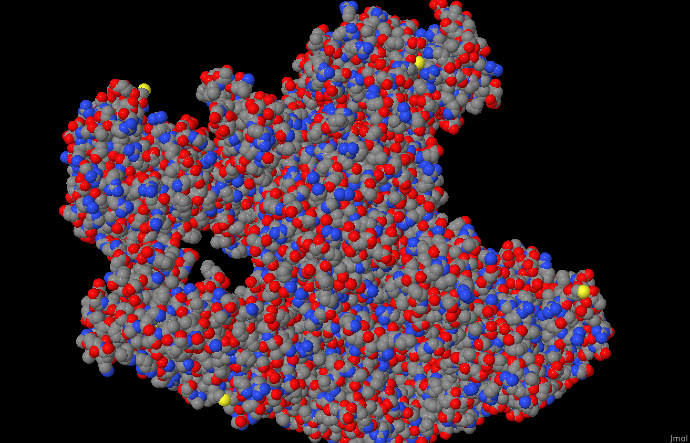
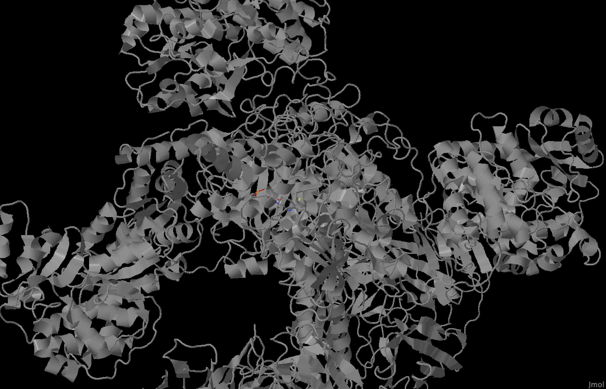
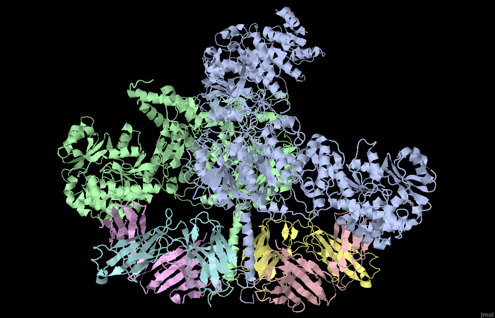

## Биоинформатика. Лабораторная работа 2

- Используемое ПО: Jmol
- Импользуемая структура белка на Protein Data Bank: [link](https://www.rcsb.org/structure/7M7I)

Jmol оказался довольно прост в использовании для решения поставленных задач, поэтому запись скринкаста с необходимыми действиями мне показалась излишней. Далее я приведу скриншоты разных представлений выбранной структуры и опишу команды, при помощи которых я получил результат.

Все взаимодействие с Jmol происходит через специальную консоль. Запустить ее можно через контекстное меню, которое вызывается кликом правой кнопкой мыши в область визаулизации. 

  

### Wireframe

`wireframe on/off` в консоли.

  

### Backbone

`backbone on/off` в консоли.

  

### Spacefill

`spacefill on/off` в консоли.

  

### Ribbons

Аналогом ribbons в Jmol является `cartoon`. Активируется при помощи `cartoon on/off` в консоли.

  

### Molecular surface

`geoSurface on/off` в консоли

  

### Цветовая модель CPK

`color cpk` в консоли.

  

### Раскраска структуры различными цветами по частям

`color chain` в консоли.

  

### Изображение публикационного качества

Попробовав найти способ получить изображение публикационного качества в Jmol, наткнулся на команду `capture`, которая позоляет создавать анимации. [link](https://sourceforge.net/p/jmol/mailman/message/33283565/)

Анимацию получил командой `capture [имя_файла] SPIN y`.

  

