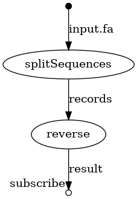
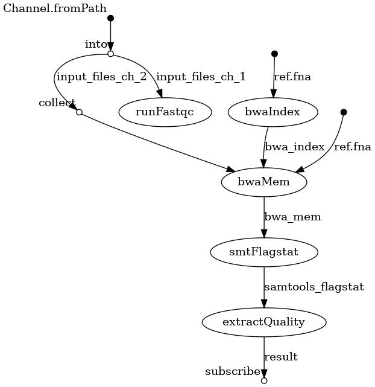

## Биоинформатика

Ссылка на прочтения: https://www.ncbi.nlm.nih.gov/sra/SRX12633907[accn]
(WGS of Escherichia coli, ILLUMINA (Illumina MiSeq))

Скрипт поддерживает парные прочтения (напр. с прибора Illumina).

Перед запуском скрипта рекомендуется добавить к имени файла окончание-порядковый номер прочтения (_1 или _2). Скрипт автоматически определит наличие второго файла и произведет необходимые вычисления с ним.

Результат работы программы `samtools flagstat` (data/21SD09GB05-EC_S16_L001_samtools.txt):
```
1770041 + 0 in total (QC-passed reads + QC-failed reads)
0 + 0 secondary
12473 + 0 supplementary
0 + 0 duplicates
1554948 + 0 mapped (87.85% : N/A)
1757568 + 0 paired in sequencing
878784 + 0 read1
878784 + 0 read2
1534876 + 0 properly paired (87.33% : N/A)
1539286 + 0 with itself and mate mapped
3189 + 0 singletons (0.18% : N/A)
0 + 0 with mate mapped to a different chr
0 + 0 with mate mapped to a different chr (mapQ>=5)
```

Пример запуска: 
```
. ./pipeline.sh ./data/21SD09GB05-EC_S16_L001 ./data/GCF_0000058452_ASM584v2_genomic
```

---

### Инструкция по работе с фрейморком построения пайплайнов Nextflow

Сайт фреймфорка: https://nextflow.io/index.html

Процесс установки утилиты расписан на сайте, он довольно прост. Продублирую его у себя.

1. Необходимо проверить наличие Java версии 8 и выше: `java -version`,
2. Введите команду `curl -s https://get.nextflow.io | bash` в корне вашего проекта. Команда создаст файл `nextflow` и директорию `.nextflow` в текущей директории,
3. Проверьте работоспособность Nextflow при помощи команды `./nextflow run hello`,
4. (Опционально) Проверьте наличие `graphvis` на вашем устройстве, это может пригодиться для конвертации визуализации пайплайна из `.dot` формата в любой общепринятый формат представления изображений (`.png`, `.jpg`, ...).

Nextflow умеет строить отчеты о работе пайплайна в виде `.html` файлов (добавьте флаг `-with-report` при запуске пайплайна), а также способен визуализировать пайплайн (при помощи флага `-with-dag [имя_файла]` в имени файла можно уточнить формат изображения, например `.png`) https://www.nextflow.io/docs/latest/tracing.html

Примеры визуализации пайплайна и отчет лежат в корне репозитория (`flowchart.png` и `report.html`). Примеры построены по тренировочному пайплайну с сайта Nextflow: https://nextflow.io/example1.html. Пайплайн можно найти в `./nfpipelines`. 

Команда для воспроизведения результатов: 
```
./nextflow ./nfpipelines/basic_pipeline.nf -with-dag flowchart.png -with-report
```

<p align="center">
  
</p>

---

### Перенос bash скрипта в пайплайн Nextflow

Реализованный пайплайн можно найти в `./nfpipelines/pipeline.nf`. Большим плюсом можно отметить автоматическое распараллеливание задач - процесс `runFastqc` может выполняться параллельно с остальными, так как не зависит от результатов выполнения других процессов (да и от него никто не зависит). В целом, поведение пайплайна ровно такое же, как и bash скрипта.

Информация, выводимая во время работы пайплайна в `stdout`:
```
N E X T F L O W  ~  version 21.04.3
Launching `nfpipelines/pipeline.nf` [admiring_hamilton] - revision: e46d35b56f
executor >  local (6)
[77/e22b20] process > runFastqc (2)  [100%] 2 of 2 ✔
[fe/c5ded8] process > bwaIndex       [100%] 1 of 1 ✔
[d2/7014b5] process > bwaMem         [100%] 1 of 1 ✔
[bb/47f560] process > smtFlagstat    [100%] 1 of 1 ✔
[d8/5a697f] process > extractQuality [100%] 1 of 1 ✔

Not OK

Completed at: 29-Oct-2021 14:01:02
Duration    : 20m 19s
CPU hours   : 0.6
Succeeded   : 6
```

Визуализация пайплайна:
<p align="center">
  
</p>

Отчет работы пайплайна можно посмотреть в `./final_report.html`